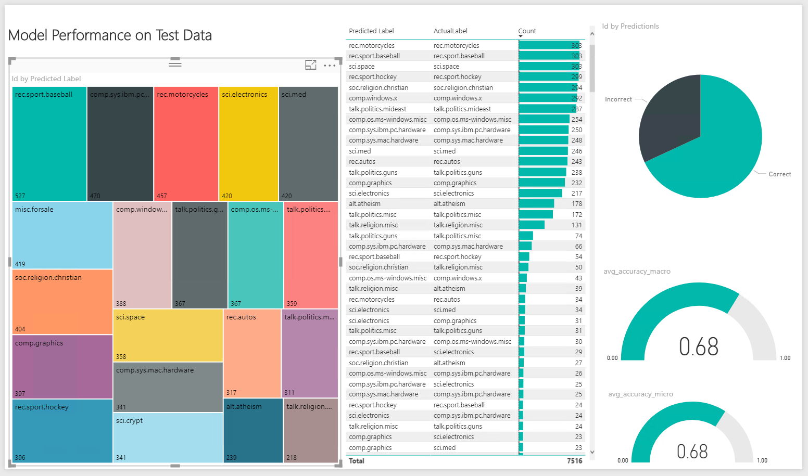
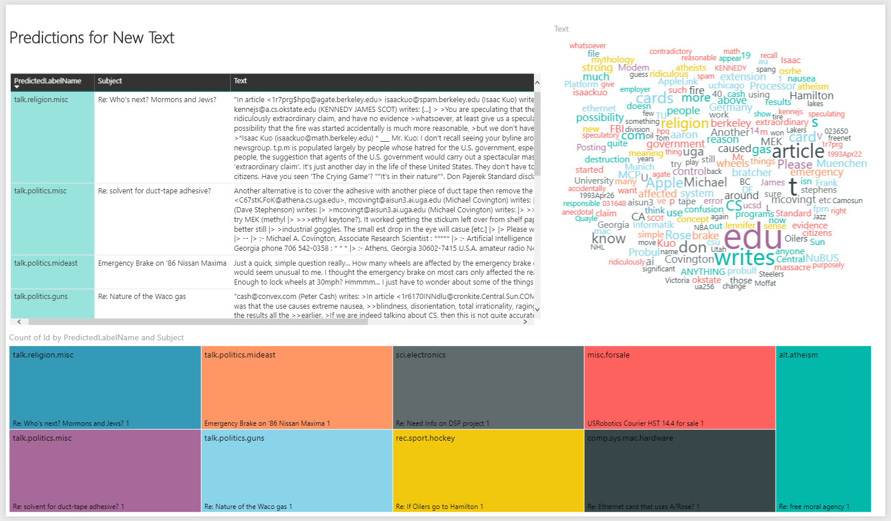

## Visualize Results
----------------------------
The Power BI file **TextClassification.pbix** included with this solution can be used to visualize how the model performs in classifying new text.  

The report contains a [wordcloud custom visual](https://appsource.microsoft.com/en-us/product/power-bi-visuals/WA104380752?src=office).  When you first open the file, you must consent to enable this custom visual. 

On the `Training Summary` tab, you can see the predicted and actual labels for the Test data, along with the Micro Average Accuracy and Macro Average Accuracy values.  

On the `Scoring New Text` tab you can view the predicted labels for new text.  

The intial version of this file contains cached data. You can refresh the
